<p align="center">
  
</p>

<h1 align="center">Agent Session Manager</h1>

<p align="center">
  A fast desktop workbench for the Claude Code and Codex sessions already sitting on your disk.
</p>

<p align="center">
  <a href="https://github.com/devincii-io/agent-session-manager/releases/latest"></a>
  
  
  <a href="LICENSE"></a>
</p>

> **Unofficial community tool.** Not affiliated with or endorsed by Anthropic or
> OpenAI. Claude is a trademark of Anthropic, PBC. Codex and OpenAI are trademarks
> of OpenAI. The app indexes local agent session data and nothing else.

---

## What it answers

Every Claude Code and Codex session leaves a `.jsonl` file behind. Nobody reads
those. This app turns them into the four questions you actually have.

**How much did this cost, and how much of my time went into it?** The overview
opens on spend and hours for the period you pick, each with its trend against
the period before, a spend-per-day chart stacked by model or by project, a
project table you can sort, and the weekday-by-hour grid of when you really
work. Cache savings get their own number, because caching is where the money
goes or does not.

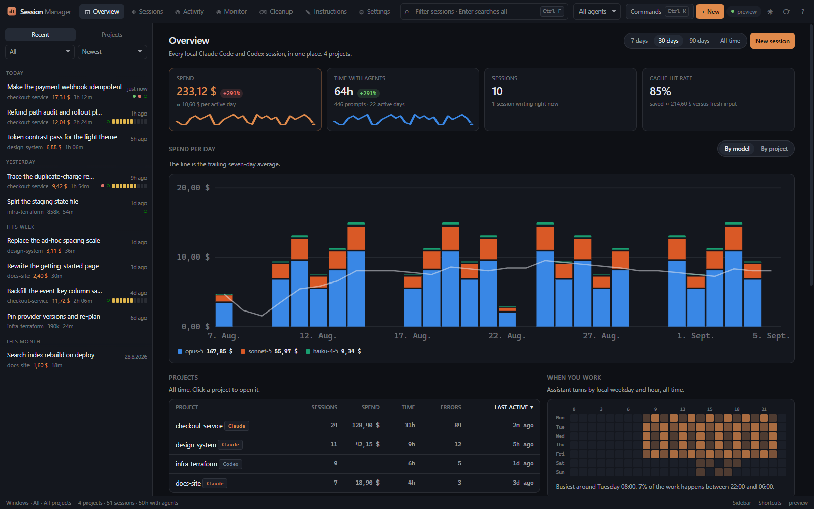

**What happened in this session, and what did it mean?** A session opens on a
summary: spend, active time versus wall clock, how full the context got, how
reliably the tools ran. Under it, findings in plain sentences. Which kind of
work ate the hours. Where the agent was idle for three hours. That the context
was compacted twice and the first time it dropped from 893k to 64k tokens.
That the same command ran eighteen times. That one file was read nine times.

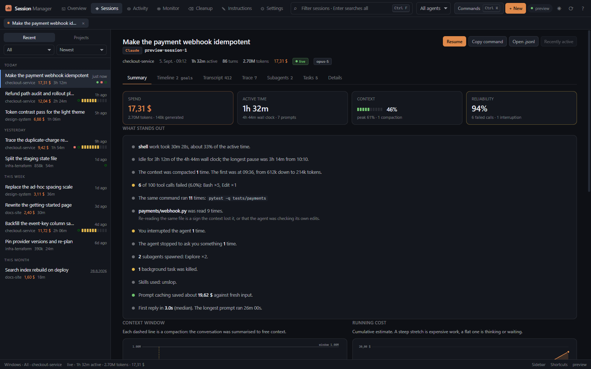

**Which skills and agents did I use, where, and what did I kill?** Skill
invocations, subagents spawned, tasks and shells stopped, and the turns you
interrupted are traced per session and rolled up across every project and both
agents. The Activity view has the totals, the tables by skill and by agent
type, and a filterable log that jumps into the session an event happened in.

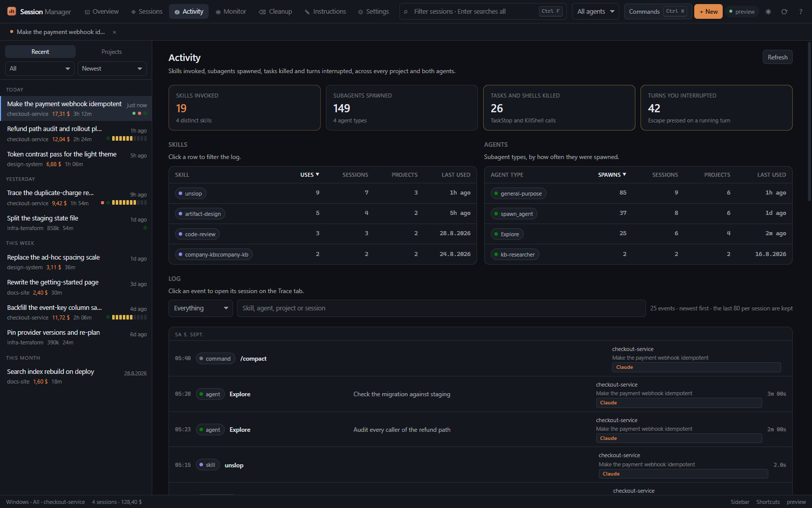

**When did it happen?** The timeline is the session on a clock. Claude Code
`/goal` runs sit on top as bands, one row per prompt below, idle gaps
collapsed, every tool call a tick in the colour of the work it did. Open a
goal and you see every follow-up you sent while it ran, every time the Stop
hook refused to let the agent finish and why, the files, the commands, and the
moment the condition held.


---

## Everything else

<table>
<tr>
<td width="50%">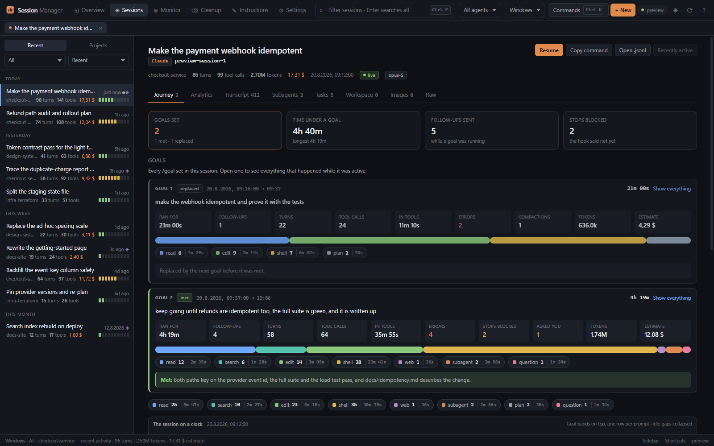</td>
<td width="50%">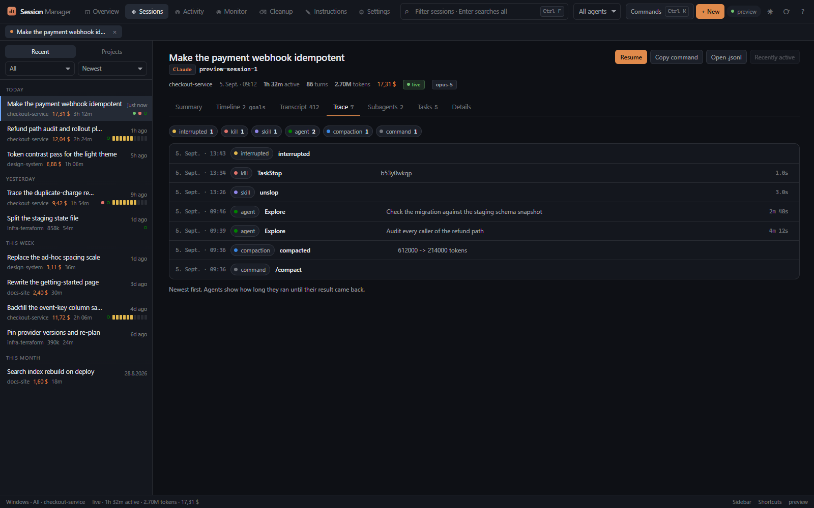</td>
</tr>
<tr>
<td><b>Timeline.</b> Goal bands, one row per prompt, ten kinds of work in ten
colours, timed from each call to its result. Click a row for everything the
agent did until your next prompt.</td>
<td><b>Trace.</b> The same session's skills, agents, kills, interruptions,
commands and compactions in order, with how long each agent ran.</td>
</tr>
<tr>
<td>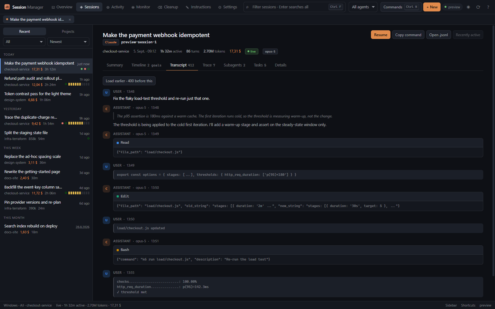</td>
<td>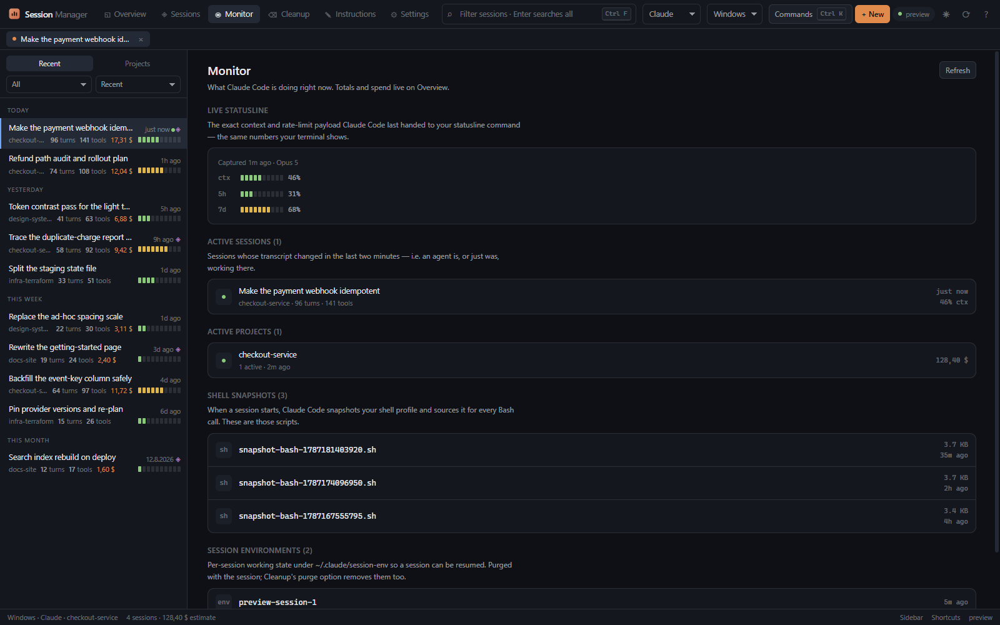</td>
</tr>
<tr>
<td><b>Transcript.</b> User, assistant, thinking, tool calls and results, paged
so a 100 MB session opens on a tail window and loads earlier pages on demand.</td>
<td><b>Monitor.</b> What is writing right now, plus the runtime state on disk:
shell snapshots, session env dirs, the live statusline capture.</td>
</tr>
<tr>
<td>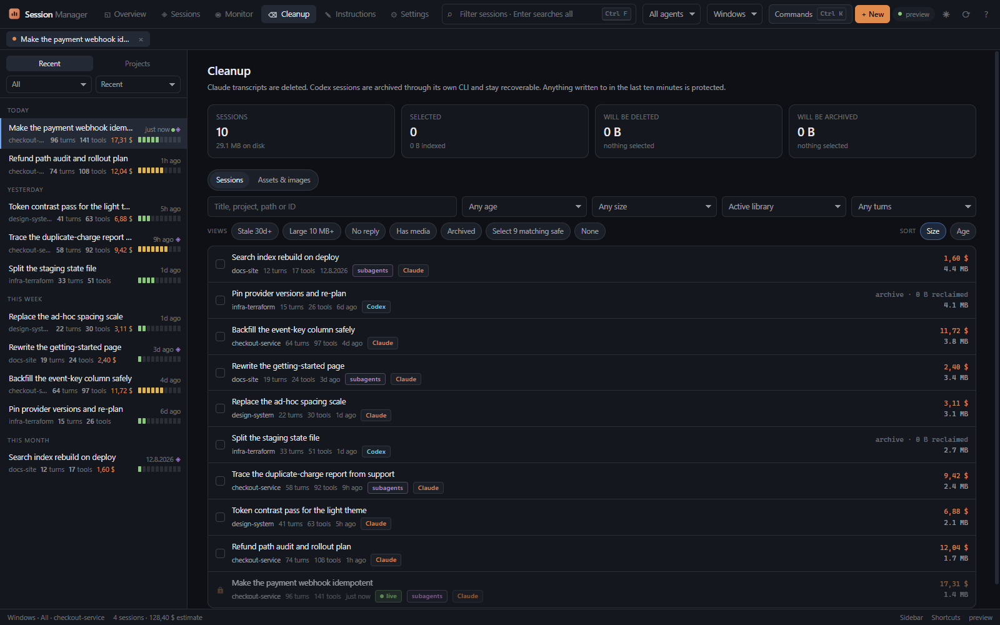</td>
<td>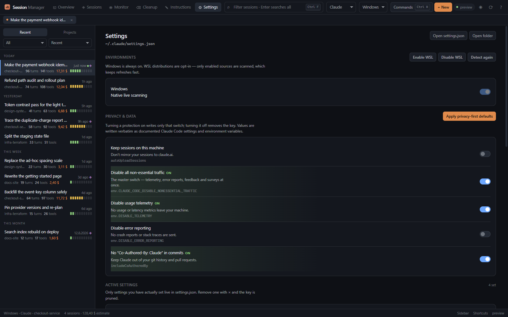</td>
</tr>
<tr>
<td><b>Cleanup.</b> Filter, select, reclaim. Sessions active in the last ten
minutes are protected, and the backend rechecks immediately before deleting.</td>
<td><b>Settings.</b> A catalog-driven editor for <code>settings.json</code>.
Only keys you actually set get written, and removing one prunes it.</td>
</tr>
</table>

*(Every screenshot is generated demo data. Open `web/index.html` in any browser
to get the same preview, which is exactly how these were captured.)*

### Browsing

**Session browser.** *Recent* lists every session on the machine grouped Today /
Yesterday / This week. *Projects* expands a project in place into a table of its
sessions with active time, errors, context and spend. Arrow keys walk the
browser, `Enter` opens, `[` and `]` step between neighbours, and sessions you
open stay as tabs.

**Agent switcher.** `All | Claude | Codex` filters which sessions you see. It is
not a claim that a conversation can be converted between agents, because it
cannot.

**Environment switcher.** Windows and each WSL distribution are independent
sources. Every launch starts on Windows alone; turn a distro on in Settings for
the current run. `All enabled` aggregates Claude and Codex metrics. Each source
is scanned in its own request on its own worker lane and painted as it lands,
so a slow WSL walk never delays the Windows figures.

**Global search.** Press Enter in the search box to search every session title
and first prompt plus your full prompt history, with jump-to-session.

### Reading a session

Past the summary, the timeline and the trace there is the transcript, subagent
sidechains and `Agent` / `Task` invocations, the task board, the per-session
scratchpad tree, a thumbnail gallery of Claude uploads, and a details tab with
the token breakdown and the resume command.

Cost is labelled honestly. Claude gets an explicit API-price estimate. Codex
ChatGPT-plan usage is never dressed up as dollars.

### Writing things back

**Memory.** The project `memory/` store, its `MEMORY.md` index and the
individual files with their frontmatter, editable and deletable in place.

**Instructions.** Drive your own signed-in `claude` CLI over your history to
refine a CLAUDE.md (global or per-project), or consolidate sessions into memory
notes. Headless, async, cancellable, backed up before writing. Only session
summaries go to the CLI, never full transcripts. Codex gets safe `config.toml`
and `AGENTS.md` editing with the same backups. The app deliberately does not
auto-synchronize AGENTS.md and CLAUDE.md.

**Privacy defaults.** One tap keeps sessions off claude.ai, kills non-essential
traffic, and disables telemetry and error reporting.

**Live statusline capture** (opt-in). Rate limits (5h / 7d) and live context
percentage never touch disk. Claude Code hands them to your statusline command
and nowhere else. A one-line hook, removable at any time, lets the app read the
latest values.

**Quick launch.** Start or resume either agent with the right provider-aware
command. On Windows the documented `codex://` deep link covers the case where
the Store CLI alias is missing. WSL launches run inside the owning distro with
its raw Linux working directory. Set `CODEX_CLI_PATH` for a native terminal
launch.

Buttons throughout open paths in VS Code or your file manager. Deletions always
confirm first.

---

## Speed

Transcripts get big. The whole design falls out of that.

- Nothing blocks the interface. Every read runs on a worker thread and answers
  over a signal; the window, the file watcher and the live ticks keep going
  while a cold index or a WSL walk is under way.
- Boot fires every request at once and paints each region as it lands. On a
  warm cache the project list, the dashboard figures and the recent list are
  all on screen about 400 ms after the page has loaded.
- Streaming `orjson` parsing. A cold 10 MB Claude transcript summarizes in
  about 40 ms. A cold index of 60 sessions and 300 MB takes under a second,
  and the status bar counts it down.
- Summaries cached on disk, keyed by mtime and size, for Codex rollouts as
  well as Claude transcripts. The cache is written at most every two seconds
  while sessions are live, not after every scan.
- Incremental parsing. While a session is live only the newly appended bytes
  are read, roughly 0.1 ms per refresh, never the whole file again. A live tick
  re-renders the open session's body, not the whole pane, so your scroll and
  selection survive.
- One walk of `projects/` serves the overview, the recent list and the global
  stats fired together, instead of stat-ing every file three times.
- Paged transcripts. The backend serves a small window and loads earlier pages
  on demand, so a 100 MB session opens straight onto its tail.
- The watcher covers transcripts, task boards, settings and the statusline
  capture, not the whole Claude home, so plugin and cache churn never triggers
  a refresh.
- WSL distro names are discovered cheaply, off the boot path, and are off at
  every launch. A distro is resolved and scanned only once you enable and
  select it, on a worker lane of its own, so it can never hold up the Windows
  figures. The distros container tooling installs for itself (Docker Desktop,
  Podman, Rancher) are never offered.

## Keyboard

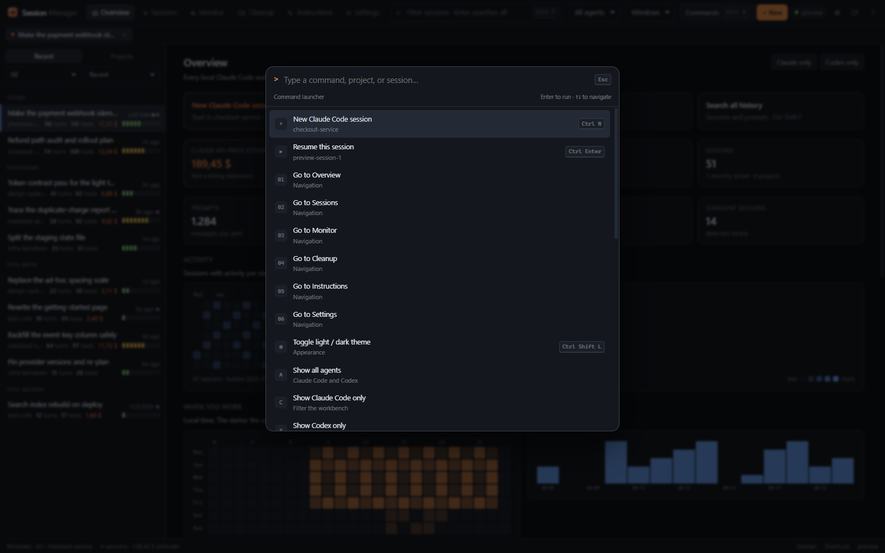

`Ctrl+K` opens every command. `Ctrl+P` quick-opens a session. `↑` and `↓` walk
the browser, `[` and `]` step between neighbouring sessions. `Ctrl+F` filters,
`Ctrl+Shift+F` searches all prompt history. `Ctrl+N` starts the selected agent
in the current project, `Ctrl+Enter` resumes the selected session. `Ctrl+1…5`
jump to Overview, Activity, Monitor, Cleanup and Instructions. `Ctrl+B`
collapses the browser, `Ctrl+Shift+L` switches theme. Press `?` in the app for
the full reference.

## Themes

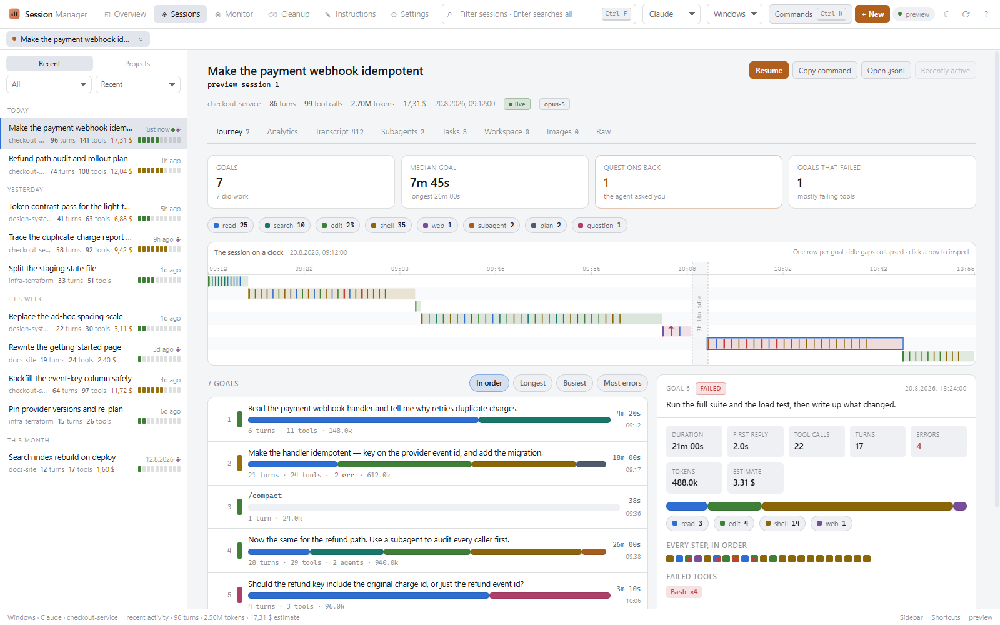

Every colour in the app resolves to a token in `web/css/tokens.css`. A hex
literal anywhere else is a bug, because it would be wrong in one of the two
themes, and a test enforces it. The eight chart hues were validated as an
ordered set for colour-vision-deficiency separation against each theme's
surface, and a test keeps the order.

---

## Install

Download `AgentSessionManager-v<version>-Setup.exe` from the
[latest release](https://github.com/devincii-io/agent-session-manager/releases/latest).
The per-user installer needs no administrator access, adds a Start Menu entry,
offers a Desktop shortcut, upgrades in place, and uninstalls normally. The app
watches the same release feed in the background and will only open an update
after both its exact installer filename and its SHA-256 checksum verify.

For a no-install copy, take the Windows portable ZIP and keep its whole
`AgentSessionManager` folder together. Linux ships as a portable single-file
executable. Verify any release file against `SHA256SUMS.txt`.

## Run from source

```bash
uv sync
uv run asm
```

`uv run python -m asm.app` works too. Python 3.10 or newer. The GUI needs a
display. On WSL, WSLg works out of the box.

## Where the data lives

| Agent | What | Path |
|---|---|---|
| Claude | Config home | `~/.claude` or `$CLAUDE_CONFIG_DIR` |
| Claude | Sessions | `~/.claude/projects/<encoded-path>/<session>.jsonl` |
| Claude | Memory / tasks | `~/.claude/projects/.../memory/`, `~/.claude/tasks/...` |
| Codex | Data home | `~/.codex` or `$CODEX_HOME` |
| Codex | Sessions | `$CODEX_HOME/sessions/YYYY/MM/DD/rollout-*.jsonl` |
| Codex | Settings / instructions | `$CODEX_HOME/config.toml`, `AGENTS.md` |
| WSL | Per-distro agent homes | `\\wsl.localhost\<distro>\...\.claude`, `.codex` |

Browsing and analytics stay on your machine. Writes happen only after an
explicit action, are path-guarded, and back up any instruction or config file
before overwriting it. The one exception to "no network" is deliberate and
labelled: instruction optimization invokes your own signed-in CLI with selected
summaries, which contacts that agent's service. Full transcripts are never sent.

## Build

```bash
uv sync --extra build
uv run pyinstaller --noconfirm AgentSessionManager.spec
```

Windows produces `dist/AgentSessionManager/`, an on-disk bundle rather than a
one-file executable, which avoids paying multi-second Qt WebEngine extraction on
every launch. Build the per-user installer with Inno Setup 6:

```powershell
& "$env:LOCALAPPDATA\Programs\Inno Setup 6\ISCC.exe" /DAppVersion=3.2.0 packaging\agent-session-manager.iss
Copy-Item README.md,LICENSE -Destination dist\AgentSessionManager
Compress-Archive -Path dist\AgentSessionManager -DestinationPath dist\AgentSessionManager-v3.2.0-Windows-x64-portable.zip -Force
```

On Linux the same spec produces one portable `dist/AgentSessionManager`. The
build keeps only the English and German Qt locales, drops Tk, splash payloads
and unused QML plugins, and bundles Linux compatibility files only on Linux.
PyInstaller cannot cross-compile, so run it on the target OS. From WSL or Linux
the guarded release helper builds in an isolated temporary environment:

```bash
bash packaging/build-linux.sh 3.2.0
```

Before publishing, write `dist/SHA256SUMS.txt` with an entry for every artifact.
Automatic installation deliberately requires the exact names
`AgentSessionManager-v<version>-Setup.exe` and `SHA256SUMS.txt`. Rename either
and the app falls back to opening the release page.

## Architecture

Built with PySide6 and QtWebEngine, managed with uv. Three runtime dependencies:
PySide6, watchdog, orjson. The frontend is vanilla JS with no build step.

```
asm/
  paths.py                 cross-platform Claude and Codex path resolution
  sources.py               lazy native/WSL source discovery and path context
  session_parser.py        streaming .jsonl parser: summary, detail, per-day
                           ledger, active clock, trace of skills/agents/kills
  codex_session_parser.py  tolerant Codex rollout adapter with the same shape
  codex_scanner.py         Codex project/session index, disk cache, locator map
  goals.py                 /goal runs, per-prompt segmentation, tool timing
  scanner.py               enumerate projects, sessions, memory, tasks, settings;
                           one memoised walk serves every aggregate
  pricing.py               model price table, cost math, cache savings
  watcher.py               watchdog to Qt signals, narrow watches (live updates)
  actions.py               delete, bulk-delete, save, settings, statusline hook
  assistant.py             headless `claude` CLI prompts and output parsing
  update.py                release-feed check and checksum-verified install
  bridge.py                the QWebChannel object: an async request lane on
                           worker threads, replies and progress over signals
  app.py                   QApplication and the QWebEngineView shell
web/
  index.html               the shell, loads everything below
  css/                     tokens (both themes), base, shell, components,
                           charts, journey, views
  js/core/                 state, the async channel client, formatting, theming
  js/ui/                   charts (with the shared hover readout), primitives
  js/views/                one file per view: overview, summary, activity,
                           journey (the timeline canvas), session, sidebar, …
  js/preview.js            fixtures that make web/index.html work in a browser
```

## Docs

[CHANGELOG](CHANGELOG.md) · [CONTRIBUTING](CONTRIBUTING.md) ·
[LICENSE](LICENSE) · [vendor/NOTICE](vendor/NOTICE)
