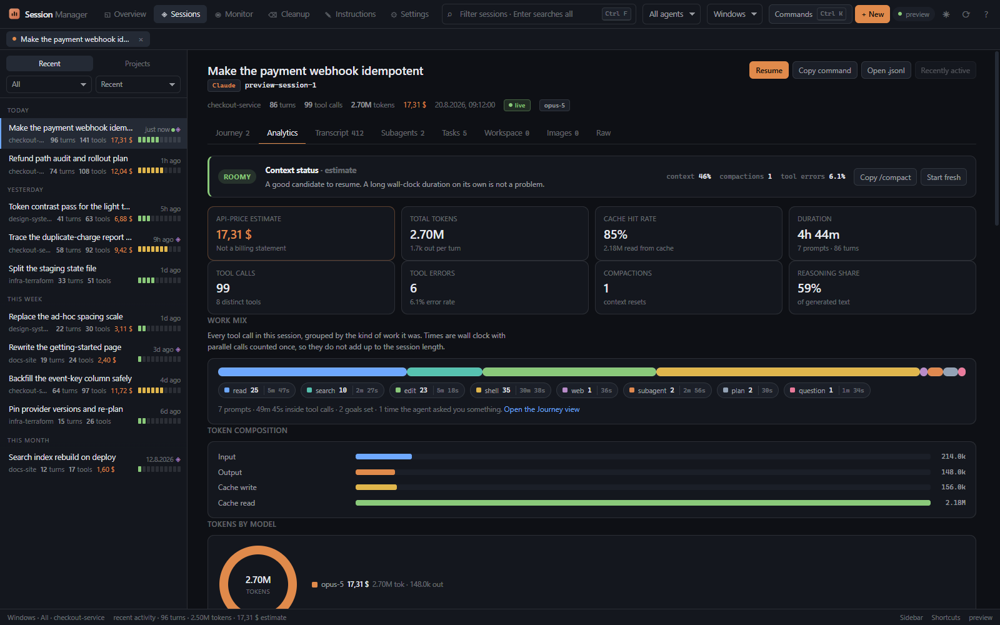

<p align="center"></p>

# Agent Session Manager

> **Unofficial community tool** — not affiliated with or endorsed by Anthropic
> or OpenAI. Claude is a trademark of Anthropic, PBC. Codex and OpenAI are
> trademarks of OpenAI. The app indexes local agent session data.

A fast desktop workbench for local **Claude Code and Codex** sessions.

When you set a **goal** with Claude Code's `/goal`, a Stop hook keeps the agent
working until its condition holds. The **Journey** view reconstructs that run:
when the goal was set, every time the hook refused to let the agent finish and
why, when the condition was finally met — and everything that happened in
between, on a real clock with the idle gaps collapsed.


Around it: browse projects and transcripts, inspect tokens, context pressure,
tools, compactions and subagents, launch or resume work, search history, manage
storage, and edit each agent's configuration without pretending their formats or
capabilities are identical. Built with **PySide6** + **QtWebEngine** and managed
with **uv**. Cross-platform: Windows and Linux. Dark and light themes.

*(Every screenshot shows generated demo data — open `web/index.html` in a browser
to get the same preview.)*

**Fast by design:** streaming `orjson` parsing (a cold 10 MB Claude transcript summarizes in
~40 ms), disk-cached summaries keyed by mtime+size, and *incremental* parsing —
while a session is live, only the newly appended bytes are read (~0.1 ms per
refresh), never the whole file. Transcripts are **paged**: the backend serves a
small window of messages and loads earlier pages on demand, so even a 100 MB
session opens with a small tail window and earlier messages load on demand. Live
tail-following keeps a bounded browser window, and path-aware filesystem events
refresh only the affected view instead of repeatedly rebuilding global analytics.
Codex rollouts are grouped by canonical working directory, parsed lazily, and
use cumulative token snapshots correctly; subagent rollouts do not inflate the
top-level session count. WSL distro names are discovered cheaply and remain off
by default; a distro is resolved and scanned only after you enable and select it.

**Fast to drive:** `Ctrl+K` opens every command, `Ctrl+P` quick-opens a session,
`↑`/`↓` walk the session browser and `[`/`]` step between neighbouring sessions,
`Ctrl+F` filters, `Ctrl+Shift+F` searches all prompt history, `Ctrl+N` starts the
selected agent in the current project, `Ctrl+Enter` resumes the selected session,
`Ctrl+B` collapses the browser and `Ctrl+Shift+L` switches theme. Press `?` inside
the app for the complete reference.

Docs: [CHANGELOG](CHANGELOG.md) · [CONTRIBUTING](CONTRIBUTING.md) ·
[LICENSE](LICENSE) · [vendor/NOTICE](vendor/NOTICE)

## What it shows

- **Journey** — a session as the arc of the work, at two levels.
  **Goals** are `/goal` runs: how long each ran, the follow-ups you sent while
  it was active, every blocked stop with the hook's reasoning, and the moment
  the condition was met. Open one to see everything inside it — every tool call
  in order, each prompt, the files touched and the commands run.
  **Prompts** are the individual requests, each with a start, an end, a
  first-reply latency and what it cost.
  Ten work categories — read, search, edit, shell, web, subagent, plan,
  question, mcp, other — carry one colour each and are timed from the call to
  its result, so the legend reads `shell 489 · 1h 22m` rather than a bare count.
- **Session browser** — *Recent* lists every session on the machine grouped
  Today / Yesterday / This week; *Projects* expands a project in place. Arrow
  keys walk it, `Enter` opens, `[`/`]` step between sessions, and recently opened
  sessions stay as tabs.
- **Agent switcher** — `All | Claude | Codex` is a visible session-source filter,
  not a claim that an existing conversation can be converted between agents.
- **Environment switcher** — Windows and each WSL distribution are independent
  sources. Enable only the distros you want in Settings; `All enabled` aggregates
  Claude and Codex metrics without slowing the default Windows-only refresh path.
- **Projects** — every local project either agent has touched, ranked by recent
  activity with explicit agent badges.
- **Sessions** — per-session transcript viewer (user / assistant / thinking / tool
  calls / results), reconstructed from the `.jsonl` transcripts.
- **Analytics** — token composition, context pressure, compactions,
  reasoning/output, tool errors, files, commands, and model share. Claude can
  show an explicitly labelled API-price estimate. Codex ChatGPT-plan usage is
  never misrepresented as dollar spend.
- **Context meters** — the statusline-style 10-slot meter, reconstructed per
  session from token usage (`input + cache_read + cache_write` ÷ context window).
- **Subagents** — sidechain messages and `Agent`/`Task` invocations.
- **Memory** — the project `memory/` store (MEMORY.md index + individual memory
  files with frontmatter), with in-app **edit / save / delete**.
- **Scratchpads** — the per-session scratchpad tree, with previews.
- **Tasks** — the per-session task board.
- **Cleanup** — narrow sessions with real title/project/source, age, size, state,
  turn, and asset filters, then explicitly select matching safe items. A separate
  Assets & images view can remove uploads, legacy images, file history, tasks,
  environments, and scratchpads without deleting transcripts. Live
  sessions active in the last 10 minutes are conservatively protected and the
  backend rechecks immediately before deletion. Claude transcripts can be
  deleted; Codex sessions are archived through the supported Codex CLI command
  and correctly report `0 B` reclaimed. WSL Claude cleanup is inspection-only.
- **Instructions** — drive your own signed-in `claude` CLI over your history to **refine
  a CLAUDE.md** (global or per-project) or **consolidate sessions into memory
  notes**. Runs headless, async, cancellable, and backed up before writing; only
  session summaries are sent, never full transcripts. Codex exposes safe
  `config.toml` and global/project `AGENTS.md` editing with backups; the app does
  not auto-synchronize AGENTS.md and CLAUDE.md.
- **Claude settings** — a comprehensive, catalog-driven editor: a **Privacy & data**
  section with one-tap privacy-first defaults (keep sessions off claude.ai, kill
  non-essential traffic, disable telemetry / error reporting), a dedicated
  **environment-variable** editor, and arbitrary custom keys — all writing
  straight to `settings.json`. Only settings you actually set are written;
  removing one prunes it, so the file never accumulates dead keys.
- **Live monitor** — recently active sessions and context pressure, updated via a
  filesystem watcher.
- **Live statusline capture** (opt-in) — rate limits (5h / 7d) and live context %
  are only handed to your statusline command by Claude Code and aren't stored on
  disk. An optional, removable one-line hook lets the app read the latest values.
- **Global search** — press Enter in the search box to search every session
  (titles, first prompts) *and* your full prompt history, with jump-to-session.
- **Image gallery** — current Claude uploads and legacy image-cache files, as thumbnails.
- **Workspace** — the per-session scratchpad *and* background-task outputs.
- **Shells & environments** — shell snapshots and session-env dirs in Monitor.
- **Settings as controls** — toggles and dropdowns writing straight to
  `settings.json`, plus an in-app editor for small config files
  (`statusline-command.sh`, `settings.json`, commands, agents…).
- **Quick launch** — start/resume Claude or Codex with the exact provider-aware
  command. On Windows, documented `codex://` desktop deep links are used when the
  Store CLI alias is unavailable; WSL launches execute inside the owning distro
  with its raw Linux working directory. Set `CODEX_CLI_PATH` for native terminal launch.

Buttons throughout open paths in **VS Code** or your file manager, and sessions /
memory can be **deleted** (with confirmation).

## Screens

| | |
|---|---|
|  **Overview** — spend, tokens, 90 days of activity, and when you actually work |  **Journey** — goals on a clock, with everything that ran inside them |
|  **Analytics** — context pressure, cache economics, the tools that failed |  **Transcript** — paged, with tool calls coloured by the kind of work |
|  **Cleanup** — narrow, select, and reclaim, with live sessions protected |  **Settings** — only what you set is written to `settings.json` |
|  **Monitor** — what is running now, and the runtime state on disk |  **Light theme** — the same palette, re-aimed for paper |

## Install

On Windows, download `AgentSessionManager-v<version>-Setup.exe` from the
[latest release](https://github.com/devincii-io/agent-session-manager/releases/latest).
The per-user installer needs no administrator access, adds a Start Menu entry,
offers an optional Desktop shortcut, supports in-place upgrades, and includes a
normal uninstaller. The app checks the same release feed in the background and
will only open an update after its exact installer filename and SHA-256 checksum
have both been verified.

For a no-install copy, download the Windows portable ZIP and keep its complete
`AgentSessionManager` folder together. Linux remains a portable single-file
executable. All release files can be verified against `SHA256SUMS.txt`.

## Where the data lives

| Agent | What | Path |
|---|---|---|
| Claude | Config home | `~/.claude` or `$CLAUDE_CONFIG_DIR` |
| Claude | Sessions | `~/.claude/projects/<encoded-path>/<session>.jsonl` |
| Claude | Memory / tasks | `~/.claude/projects/.../memory/`, `~/.claude/tasks/...` |
| Codex | Data home | `~/.codex` or `$CODEX_HOME` |
| Codex | Sessions | `$CODEX_HOME/sessions/YYYY/MM/DD/rollout-*.jsonl` |
| Codex | Settings / instructions | `$CODEX_HOME/config.toml`, `AGENTS.md` |
| WSL | Per-distro agent homes | `\\wsl.localhost\<distro>\...\.claude`, `.codex` |

## Run

```bash
uv sync
uv run asm
```

or `uv run python -m asm.app`.

## Build distributable applications

```bash
uv sync --extra build
uv run pyinstaller --noconfirm AgentSessionManager.spec
```

Windows produces `dist/AgentSessionManager/`, an on-disk application bundle.
This avoids the multi-second extraction cost of a large Qt WebEngine one-file
executable on every launch. Build its per-user installer with Inno Setup 6:

```powershell
& "$env:LOCALAPPDATA\Programs\Inno Setup 6\ISCC.exe" /DAppVersion=3.1.0 packaging\agent-session-manager.iss
Copy-Item README.md,LICENSE -Destination dist\AgentSessionManager
Compress-Archive -Path dist\AgentSessionManager -DestinationPath dist\AgentSessionManager-v3.1.0-Windows-x64-portable.zip -Force
```

On Linux the same spec produces a single portable `dist/AgentSessionManager`
executable. The build keeps only English/German Qt locales, omits Tk/splash
payloads and unused QML plugins, and bundles Linux compatibility files only on Linux. PyInstaller
cannot cross-compile, so run it on the target OS. From WSL or Linux, the guarded
release helper builds in an isolated temporary environment:

```bash
bash packaging/build-linux.sh 3.1.0
```

Before publishing, create `dist/SHA256SUMS.txt` with SHA-256 entries for every
release artifact. Automatic installation deliberately requires the exact names
`AgentSessionManager-v<version>-Setup.exe` and `SHA256SUMS.txt`; changing those
names makes the app fall back to opening the release page.

## Architecture

```
asm/
  paths.py            cross-platform Claude and Codex path resolution
  pricing.py          model price table + cost math
  session_parser.py   streaming .jsonl parser (summary + detail)
  codex_session_parser.py  tolerant Codex rollout adapter
  codex_scanner.py    Codex project/session index and locator map
  sources.py          lazy native/WSL source discovery and path context
  goals.py            /goal runs, per-prompt segmentation, tool categorisation and timing
  scanner.py          enumerate projects/sessions/memory/tasks/scratchpad/settings (cached)
  watcher.py          watchdog → Qt signals (live updates)
  actions.py          delete / bulk-delete / save / settings / statusline hook
  assistant.py        headless `claude` CLI prompts + output parsing (Tune)
  bridge.py           QWebChannel object exposed to JS
  app.py              QApplication + QWebEngineView shell
web/
  index.html          the shell; loads everything below, no build step
  css/                tokens (both themes) → base → shell → components → charts
                      → journey → views
  js/core/            state, the QWebChannel client, formatting, theming
  js/ui/              charts, markup primitives, toasts and dialogs
  js/views/           one file per view; journey.js owns the canvas ribbon
  js/preview.js       fixtures that make web/index.html work in a plain browser
```

Every colour in the app resolves to a token in `css/tokens.css`; a hex literal
anywhere else is a bug, because it would be wrong in one of the two themes. A
test enforces it.

Browsing and analytics stay local. Writes occur only after an explicit action and
are path-guarded; instruction/config overwrites create backups. Claude instruction
optimization intentionally invokes your signed-in local CLI with selected summaries,
which may contact that agent's service. Full transcripts are not sent by the app.
